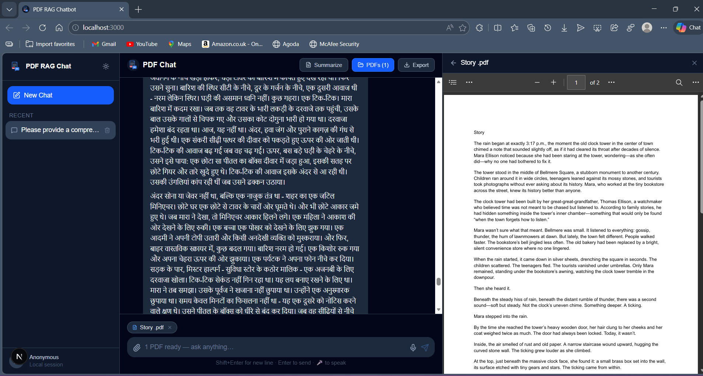

# PDF RAG — AI-Powered PDF Chat

A full-stack Retrieval-Augmented Generation (RAG) app that lets you upload PDFs, ask questions about them, get summaries, translate content, and merge documents — all powered by Groq (LLaMA 3.3) and Qdrant vector search.

---

## Screenshots

| Translation (10+ languages) | In-app PDF Preview |
|---|---|
|  |  |

---

## Features

- **Chat with PDFs** — Ask natural language questions; answers are grounded in the document content via semantic search
- **Multi-PDF support** — Upload multiple PDFs and query across all of them simultaneously
- **Streaming responses** — Token-by-token streaming for a real-time chat feel
- **PDF Translation** — Translate full documents into 10+ languages
- **PDF Merge** — Combine multiple PDFs into one and embed the result
- **Summarization** — One-click AI summary of any uploaded PDF
- **Follow-up suggestions** — Auto-generated follow-up questions after each answer
- **Chat history** — Sessions saved locally with full conversation memory
- **Export** — Download chat history as Markdown or plain text

## Tech Stack

| Layer | Technology |
|---|---|
| Frontend | Next.js 16, React 19, Tailwind CSS v4 |
| Backend | FastAPI (Python), Uvicorn |
| LLM | Groq API — LLaMA 3.3 70B Versatile |
| Embeddings | FastEmbed — `nomic-ai/nomic-embed-text-v1.5` (local, no API cost) |
| Vector DB | Qdrant (Docker locally / Qdrant Cloud for deployment) |
| PDF Parsing | LangChain + PyPDF |
| Chat History | SQLite |

## Architecture

```
Browser (Next.js)
      │  REST + SSE
      ▼
FastAPI Server
  ├── /upload/pdf       → save file + background embed task
  ├── /chat/stream      → SSE token stream (RAG pipeline)
  ├── /pdf/translate/stream → SSE translation stream
  └── /pdf/merge        → merge + re-embed
      │
      ├── FastEmbed (local embeddings)
      ├── Qdrant (vector store)
      └── Groq (LLM inference)
```

## Getting Started

### Prerequisites

- Python 3.11+
- Node.js 18+ and pnpm
- Docker (for local Qdrant) **or** a [Qdrant Cloud](https://cloud.qdrant.io) account
- A free [Groq API key](https://console.groq.com)

### 1. Clone the repo

```bash
git clone https://github.com/Nilabha-Das/pdf-rag.git
cd pdf-rag
```

### 2. Backend setup

```bash
cd server
python -m venv .venv
.venv\Scripts\activate        # Windows
# source .venv/bin/activate   # macOS/Linux

pip install -r requirements.txt

cp .env.example .env
# Edit .env and fill in your GROQ_API_KEY and Qdrant credentials
```

### 3. Start Qdrant (local Docker)

```bash
cd ..   # back to repo root
docker compose up -d
```

> Skip this step if you are using Qdrant Cloud — just set the cloud URL/key in `.env`.

### 4. Start the backend

```bash
cd server
uvicorn main:app --host 127.0.0.1 --port 8000 --reload
```

### 5. Frontend setup

```bash
cd ../client
pnpm install
pnpm dev
```

Open **http://localhost:3000**

## Environment Variables

See [`server/.env.example`](server/.env.example) for all required variables.

| Variable | Description |
|---|---|
| `GROQ_API_KEY` | Groq API key — free at console.groq.com |
| `QDRANT_URL` | Qdrant URL (`http://localhost:6333` or cloud URL) |
| `QDRANT_API_KEY` | Qdrant API key (leave blank for local Docker) |
